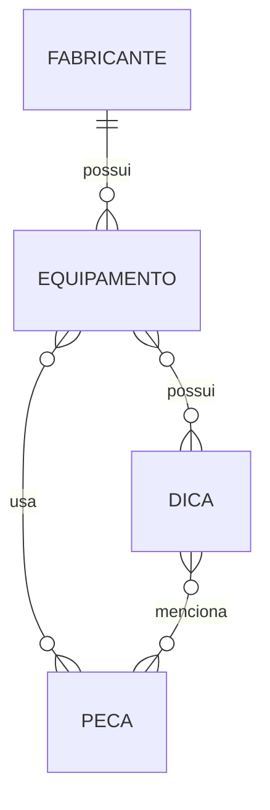

# Análise de Requisitos / Prompt de Geração

> Prompt usado para gerar a arquitetura, entidades e endpoints desta API.

```markdown
# Prompt: API Backend de Dicas de Conserto com Spring Boot 3.4.1, Java 17 e SQL Server

## Contexto & Objetivo

Você é um **especialista em Java 17, Spring Boot 3.4.1 e arquitetura de software**. Seu objetivo é gerar uma **API REST completa, limpa e testável** para um sistema de consulta de dicas de conserto de equipamentos, utilizando **JPA, SQL Server** como banco de dados, seguindo rigorosamente os princípios **SOLID, Clean Code e boas práticas de segurança (Fortify)**.

A API deve ser preparada para **CRUD completo**, sem autenticação, com **testes unitários** usando **JUnit 5 e Mockito**, e pronta para evolução futura.

---

## 📋 Entidades & Relacionamentos

### 1. **Equipamento**
- **id** (UUID/Long): identificador único
- **modelo** (String, obrigatório): ex. "LaserJet Pro M404n"
- **categoria** (Enum, obrigatório): impressora, scanner, copiadora, etc.
- **tipo** (String, obrigatório): laser, jato de tinta, matricial (varia por categoria)
- **fabricante** (relação 1:N com Fabricante)
- **dicas** (relação M:N com Dica via tabela associativa `equipamento_dica`)
- **peças** (relação M:N com Peça via tabela associativa `equipamento_peca`)

### 2. **Fabricante**
- **id** (UUID/Long): identificador único
- **nome** (String, obrigatório, unique): ex. "HP Inc."
- **sigla** (String, obrigatório, unique, 2-5 caracteres): ex. "HP"
- **equipamentos** (relação 1:N com Equipamento)

### 3. **Dica**
- **id** (UUID/Long): identificador único
- **problemDescricao** (String, obrigatório, length: 50-1000): descrição detalhada do problema
- **solucaoDescricao** (String, obrigatório, length: 50-2000): descrição da solução
- **dataCriacao** (LocalDateTime, obrigatório, @CreationTimestamp): quando foi criada
- **dataAtualizacao** (LocalDateTime, @UpdateTimestamp): última atualização
- **ativo** (Boolean, default: true): soft delete flag
- **equipamentos** (relação M:N com Equipamento)
- **peças** (relação M:N com Peça)

### 4. **Peça**
- **id** (UUID/Long): identificador único
- **nome** (String, obrigatório): ex. "Rolo de Pressão"
- **partNumber** (String, obrigatório, unique): ex. "RM1-4426-000CN"
- **categoria** (String, opcional): ex. "Consumível", "Componente Eletrônico"
- **equipamentos** (relação M:N com Equipamento)
- **dicas** (relação M:N com Dica)

### Relacionamentos Específicos:
- **Equipamento M:N Dica**: um equipamento pode ter múltiplas dicas; uma dica pode aplicar-se a múltiplos equipamentos
- **Equipamento M:N Peça**: um equipamento pode usar múltiplas peças; uma peça pode ser usada em múltiplos equipamentos
- **Dica M:N Peça**: uma dica pode mencionar múltiplas peças; uma peça pode estar em múltiplas dicas

---

## 🏗️ Arquitetura & Estrutura

```
src/main/java/com/repairsystem/
├── config/
│   └── JpaConfig.java (configurações de JPA/SQL Server)
├── domain/
│   ├── entity/
│   │   ├── Equipamento.java
│   │   ├── Fabricante.java
│   │   ├── Dica.java
│   │   └── Peca.java
│   └── enums/
│       └── CategoriaEquipamento.java
├── repository/
│   ├── EquipamentoRepository.java
│   ├── FabricanteRepository.java
│   ├── DicaRepository.java
│   └── PecaRepository.java
├── service/
│   ├── EquipamentoService.java
│   ├── FabricanteService.java
│   ├── DicaService.java
│   └── PecaService.java
├── controller/
│   ├── EquipamentoController.java
│   ├── FabricanteController.java
│   ├── DicaController.java
│   └── PecaController.java
├── dto/
│   ├── request/
│   │   ├── EquipamentoRequestDTO.java
│   │   ├── FabricanteRequestDTO.java
│   │   ├── DicaRequestDTO.java
│   │   └── PecaRequestDTO.java
│   └── response/
│       ├── EquipamentoResponseDTO.java
│       ├── FabricanteResponseDTO.java
│       ├── DicaResponseDTO.java
│       └── PecaResponseDTO.java
├── exception/
│   ├── EntityNotFoundException.java
│   └── GlobalExceptionHandler.java
└── RepairApiApplication.java

src/test/java/com/repairsystem/
├── service/
│   ├── EquipamentoServiceTest.java
│   ├── FabricanteServiceTest.java
│   ├── DicaServiceTest.java
│   └── PecaServiceTest.java
├── controller/
│   └── EquipamentoControllerTest.java
└── repository/
    └── EquipamentoRepositoryTest.java
```

---

## 🧩 Diagramas (Mermaid)

### Arquitetura em camadas
```mermaid
flowchart TB
  Client[Cliente (HTTP)] --> Controller[Controller REST]
  Controller --> Service[Service (Lógica de Negócio)]
  Service --> Repository[Repository (JPA)]
  Repository --> Database[SQL Server]
```

### Modelo Entidade-Relacionamento

```
